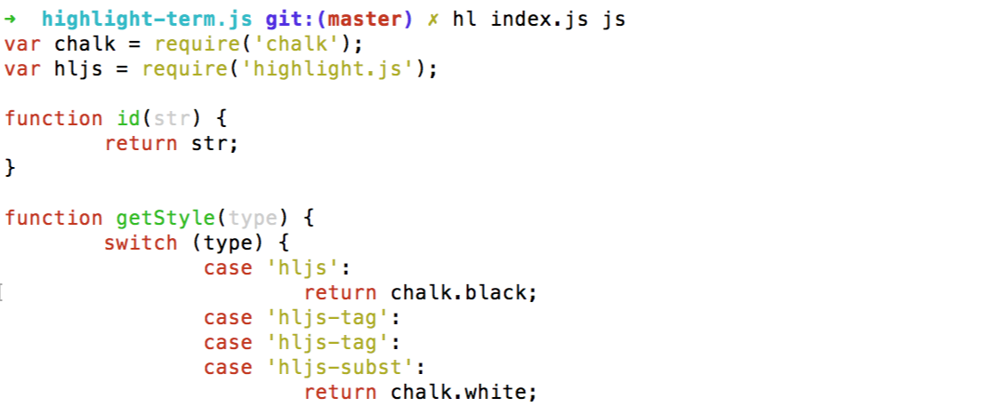
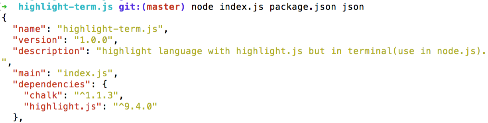

# highlight-term.js
highlight language with highlight.js but in terminal(use in node.js).

## usage

### api

```js
var hljs = require('highlight-term.js');
console.log(hljs.highlight('js', 'function fnName() {}').value);
```

### cli

```bash
# npm install with -g
npm install highlight-term.js -g

# use in term
# cat-hl <filename> [language]
hl package.json json
hl index.js js
```

### screenshot



